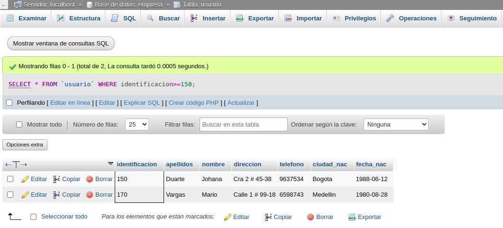
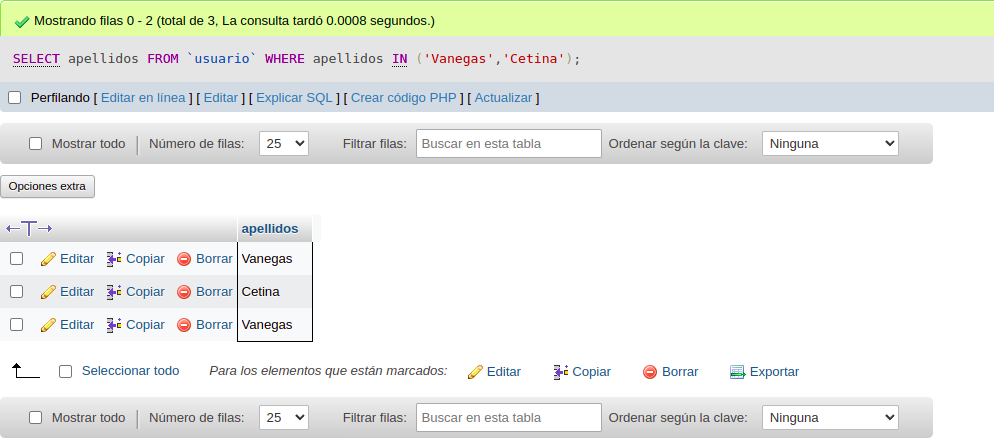

# consultas1_sql

# EJERCICIOS CONSULTAS SQL

## Tabla usuario

1. Para visualizar toda la información que contiene la tabla `usuario` se puede incluir con la instrucción SELECT el caracter `^` o cada una de los campos de la tabla 

`select * from usuario`

2. Seleccionar o visualizar solamente la identificación del usuario.

`select identificación from usuario`

3. Si se desea optener los registros cuya identificación mayor o iguales a 150, se debe utilizar la clausura WHERE que especifica las condiciones que debe reunir los registros que se van a seleccionar.

`SELECT * FROM usuario WHERE identificación>=`150``

4. Si se desea obtener los registros cuyos apellidos sean Vanegas o Cetina, se debe utilizar el operador IN que especifica los registros que se quieren visualizar de una tabla.

`SELECT apellidos FROM usuario WHERE apellidos IN (`Vanegas`,`Cetina`)`

`SELECT apellidos FROM usuario WHERE apellidos=`Vanegas`OR apellidos=`Cetina``

5. Si se desea obtener los registros cuya identificación sea menor de '110' y la ciudad sea 'Cali', se debe utilizar el operador AND.

`SELECT * FROM  usuario WHERE identificacion<'110' AND ciudad_nac='Cali'`

6. Si se desea obtener los registros cuyos nombres empiecen por la letra 'A', se debe utilizar el operador LIKE que utiliza los patrones'%' (todos) y '_' (caracter).

`SELECT * FROM usuario WHERE nombre LIKE 'AN'`

